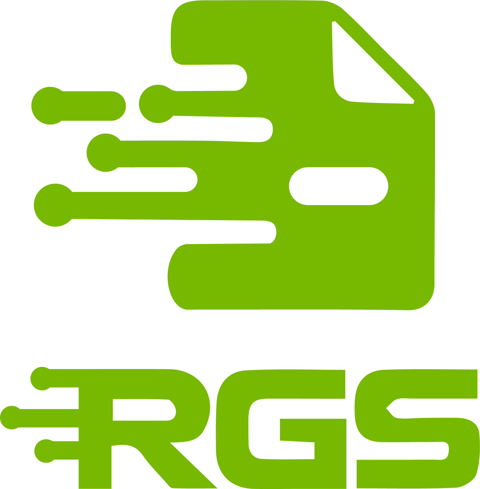

# Report Generative Security Tool (RGS)

<div align="center">
    
</div>


## About

The **Report Generative Security Tool (RGS)** is an innovative application developed for the [Generative AI Agents Developer Contest organized by NVIDIA and LangChain](https://www.nvidia.com/en-us/ai-data-science/generative-ai/developer-contest-with-langchain/). This project leverages advanced technologies such as TensorRT-LLM via Chat With RTX and the Mistral 7B model to automate and optimize the generation of comprehensive security audit reports.

[](https://opensource.org/licenses/MIT)
[](https://www.python.org/downloads/release/python-380/)
[](https://flask.palletsprojects.com/en/1.1.x/)


<div align="center">
    
</div>

## Problem

In the rapidly evolving field of cybersecurity, generating vulnerability reports is a critical yet time-consuming task. Consultants often spend hours documenting vulnerabilities, which reduces the time available for identifying and addressing new threats. This inefficiency hampers productivity and risks the quality and consistency of the reports.

## Solution

Introducing the **Report Generative Security Tool (RGS)**, a groundbreaking application that revolutionizes vulnerability report generation by leveraging NVIDIA's GeForce RTX 3000 series GPUs. Our solution uses advanced tensor LLM to optimize inference, delivering highly accurate and detailed reports in record time.


### Key Benefits of RGS:

- **Harnessing NVIDIA Technology**: Utilizes the power of NVIDIA's CUDA cores for unparalleled efficiency and speed.
- **AI-Powered Precision**: Ensures high-quality, consistent, and accurate reports.
- **Real-World Impact**: Frees consultants to focus on proactive threat detection and mitigation, enhancing overall security.

RGS is not just a technological advancement; it's a real-world solution that strengthens the cybersecurity landscape. By embracing NVIDIA's powerful hardware, we pave the way for more efficient and impactful security practices.

**Experience the future of cybersecurity with RGS—one report at a time.**

## Features

- **Generative AI Integration**: Leverages TensorRT-LLM via Chat With RTX and the Mistral 7B model to generate comprehensive vulnerability reports.
- **Risk, Priority, and Complexity Analysis**: Visual charts to illustrate vulnerability distributions.
- **Automatic Report Generation**: Easily create professional-grade security audit reports.
- **Database Management**: Efficiently manage vulnerabilities and reports with SQLite.
- **User-Friendly Interface**: Intuitive web interface for managing and generating reports.

## Installation

To get started with RGS, follow these steps:

1. **Clone the repository**:
    ```bash
    git clone https://github.com/yourusername/RGS.git
    cd RGS
    ```

2. **Install the necessary dependencies**:
    ```bash
    pip install -r requirements.txt
    ```

3. **Setup Chat With RTX**:
    Follow the instructions on the [Chat With RTX GitHub repository](https://github.com/NVIDIA/ChatRTX) to set up TensorRT-LLM and the Chat With RTX application.

4. **Download and setup Mistral 7B model**:
    Follow the instructions on the [Mistral AI official page](https://www.mistralai.com) to download and set up the Mistral 7B model.

5. **Initialize the database**:
    ```bash
    python app.py
    ```

## Usage

1. **Run the application**:
    ```bash
    python app.py
    ```

2. **Access the application**:
    Open your web browser and navigate to `http://127.0.0.1:5000/`.

3. **Generate Reports**:
    - Enter the company name, audit date, and number of vulnerabilities.
    - Click on "Generate Fields" to input vulnerability details.
    - Submit vulnerabilities and generate the report.

## Project Structure

