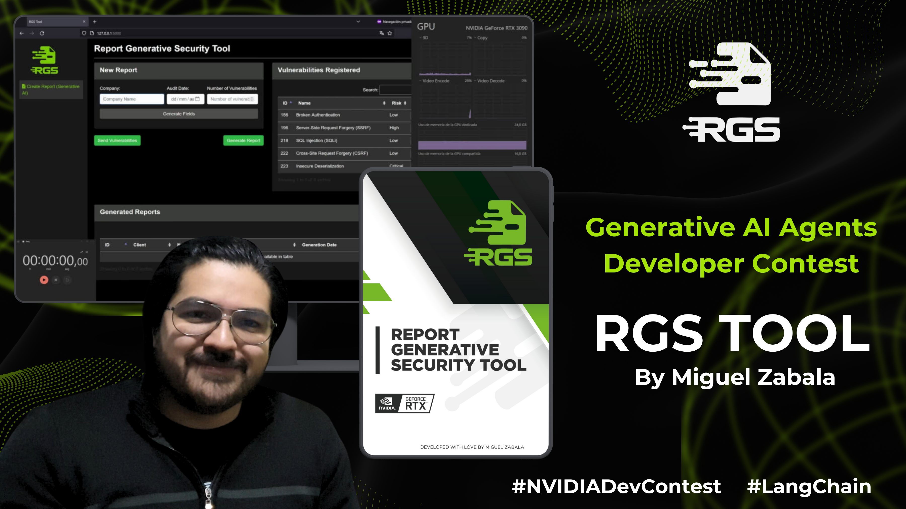
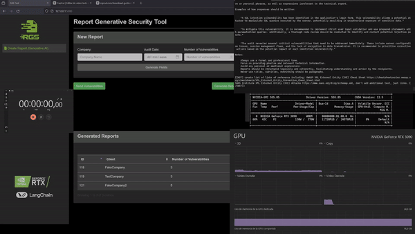
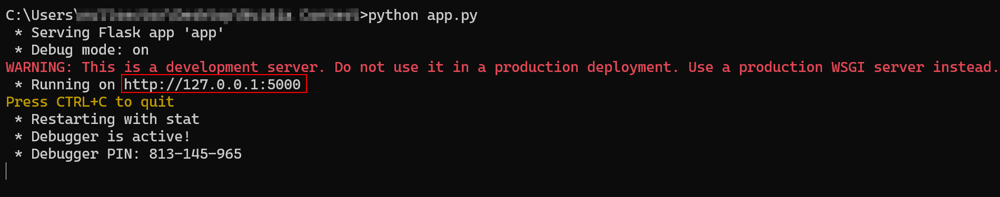
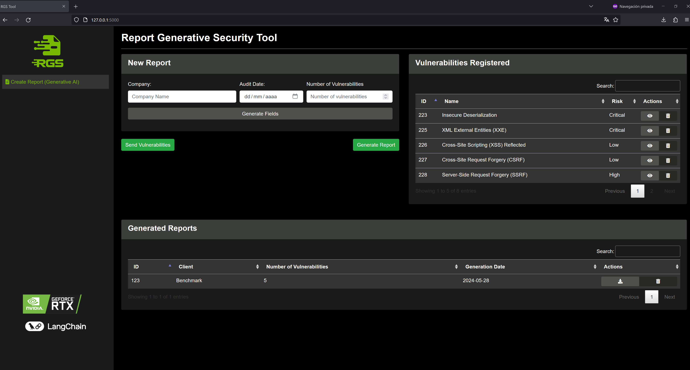

# Report Generative Security Tool (RGS)

<div align="center">
    
</div>


## ABOUT

The **Report Generative Security Tool (RGS)** is an innovative project developed with love by [Miguel Zabala](https://www.linkedin.com/in/miguelzabalap/) for the [Generative AI Agents Developer Contest organized by NVIDIA and LangChain](https://www.nvidia.com/en-us/ai-data-science/generative-ai/developer-contest-with-langchain/). This project leverages advanced technologies such as TensorRT-LLM via API [ChatRTX](https://github.com/NVIDIA/ChatRTX) using Mistral 7B model to automate and optimize the generation of comprehensive security audit reports.

Contest video: [Youtube](https://youtu.be/ED45kjvfaSQ?si=5_bE4Pv1JhcnmYT6)

[](https://opensource.org/licenses/MIT)
[](https://www.python.org/downloads/release/python-380/)
[](https://flask.palletsprojects.com/en/1.1.x/)


<div align="center">
   <a href="https://www.youtube.com/watch?v=ED45kjvfaSQ">
      
   </a>
</div>


## TACKLING CYBERSECURITY CHALLENGES WITH CUTTING-EDGE SOLUTIONS

In the rapidly evolving field of cybersecurity, generating vulnerability reports is a critical yet time-consuming task. Consultants often spend hours documenting vulnerabilities, which reduces the time available for identifying and addressing new threats. This inefficiency hampers productivity and risks the quality and consistency of the reports.

Introducing the **Report Generative Security Tool (RGS)**, a groundbreaking application that revolutionizes vulnerability reporting by leveraging the power of NVIDIA's GeForce RTX 3xxx and RTX 4xxx series GPUs. This solution uses [TensorRT-LLM](https://github.com/NVIDIA/TensorRT-LLM/) to optimize inference, delivering highly accurate and detailed reports in record time.


### KEY BENEFITS:

- **Harnessing NVIDIA Technology**: Utilizes the power of NVIDIA's CUDA cores for unparalleled efficiency and speed.
- **AI-Powered Precision**: Ensures high-quality, consistent, and accurate reports.
- **Real-World Impact**: Frees consultants to focus on proactive threat detection and mitigation, enhancing overall security.

RGS is not just a technological advancement; it's a real-world solution that strengthens the cybersecurity landscape. By embracing NVIDIA's powerful hardware, we pave the way for more efficient and impactful security practices.

**Experience the future of cybersecurity with RGS—one report at a time.**

<div align="center">
    
</div>

## FEATURES

- **Generative AI Integration**: Leverages [TensorRT-LLM](https://github.com/NVIDIA/TensorRT-LLM/) via API [ChatRTX](https://github.com/NVIDIA/ChatRTX) and the Mistral 7B model to generate comprehensive vulnerability reports.
- **Risk, Priority, and Complexity Analysis**: Visual charts to illustrate vulnerability distributions.
- **Automatic Report Generation**: Easily create professional-grade security audit reports.
- **Database Management**: Efficiently manage vulnerabilities and reports with SQLite.
- **User-Friendly Interface**: Intuitive web interface for managing and generating reports.


## CONFIDENTIALITY AND SECURITY

In the realm of cybersecurity, confidentiality is paramount. While solutions like ChatGPT are accessible to anyone, they pose significant risks regarding the confidentiality of sensitive information. This is a critical concern that makes such solutions unviable for many enterprises. 

The **Report Generative Security Tool (RGS)** addresses these concerns by ensuring that companies implementing this tool maintain full control over their data. With RGS, you can:

- **Ensure Confidentiality**: Keep sensitive information secure within your infrastructure.
- **Achieve Tracability**: Maintain detailed logs and traceability of generated reports and their sources.
- **Seamless Integration**: Deploy RGS in your production environments, fully integrated with your existing systems and workflows.

<div align="center">
    


</div>

## Blazing Fast with RTX Speed 🚀

The RGS tool demonstrates exceptional performance and efficiency in real-world scenarios. In our benchmarks, RGS generated 4749 words across 21 pages in less than a minute and a half, showcasing its ultra-fast processing capabilities. This speed and efficiency make RGS a powerful tool for consultants and security professionals who need to quickly generate comprehensive and accurate vulnerability reports.

<div align="center">
    


</div>

For a detailed benchmark, watch our [YouTube video](https://youtu.be/jU9_fqLk5P4) demonstrating the RGS tool power in action.


## USER-FRIENDLY INTERFACE

The **Report Generative Security Tool (RGS)** features a simple and easy-to-use graphical interface that allows users to:

- **Utilize Templates**: Access previously reported vulnerability templates for faster report generation.
- **Create New Entries**: Add new vulnerabilities with ease.
- **Modify Existing Entries**: Update and refine existing vulnerability details.
- **Delete Entries**: Remove outdated or irrelevant vulnerabilities.

This intuitive interface ensures that users can optimize their time by focusing on identifying critical vulnerabilities, thereby providing more value to clients and generating more precise and concise reports with the help of AI.

<div align="center">
    


</div>

## INSTALATION

To get started with RGS, follow these steps:

1. **Clone the repository**:
    ```bash
    git clone https://github.com/yourusername/RGS.git
    cd RGS
    ```

2. **Start virtual enviroment**:
    ```bash
    python -m venv env
    .\env\Scripts\activate
    ```
3. **Install dependencies**:
    ```bash
    pip install -r requirements.txt
    ```
    
4. **Setup Chat With RTX**:
    Follow the instructions on the [Chat With RTX GitHub repository](https://github.com/NVIDIA/ChatRTX) to set up TensorRT-LLM and the Chat With RTX application.


## USAGE

1. **Run the application**:
    ```bash
    python app.py
    ```
<div align="center">
    
</div>

2. **Access the application**:
    Open your web browser and navigate to `http://127.0.0.1:5000/`.

   <div align="center">
    
</div>

3. **Generate Reports**:
    - Enter the company name, audit date, and number of vulnerabilities.
    - Click on "Generate Fields" to input vulnerability details.
    - Submit vulnerabilities and generate the report.
  
## EXTENDED DEMO

Experience the full potential of the **Report Generative Security Tool (RGS)** through an extended demo. In this section, we showcase the capabilities of RGS with a pseudo real-world example. Watch how RGS generates comprehensive security audit reports efficiently and accurately.

<div align="center">
    
</div>

For a detailed walkthrough, watch our [YouTube video](https://www.youtube.com/watch?v=j4wibVN09cI) demonstrating the RGS tool deployment and his power in action.


## License

This project is open-source and licensed for the Generative AI Agents Developer Contest organized by NVIDIA and LangChain.

Developed by Miguel Zabala (Nullsector) for the [Generative AI Agents Developer Contest organized by NVIDIA and LangChain](https://www.nvidia.com/en-us/ai-data-science/generative-ai/developer-contest-with-langchain/). RGS leverages open-source software to make it easier to produce professional-grade security reports with minimal effort.


