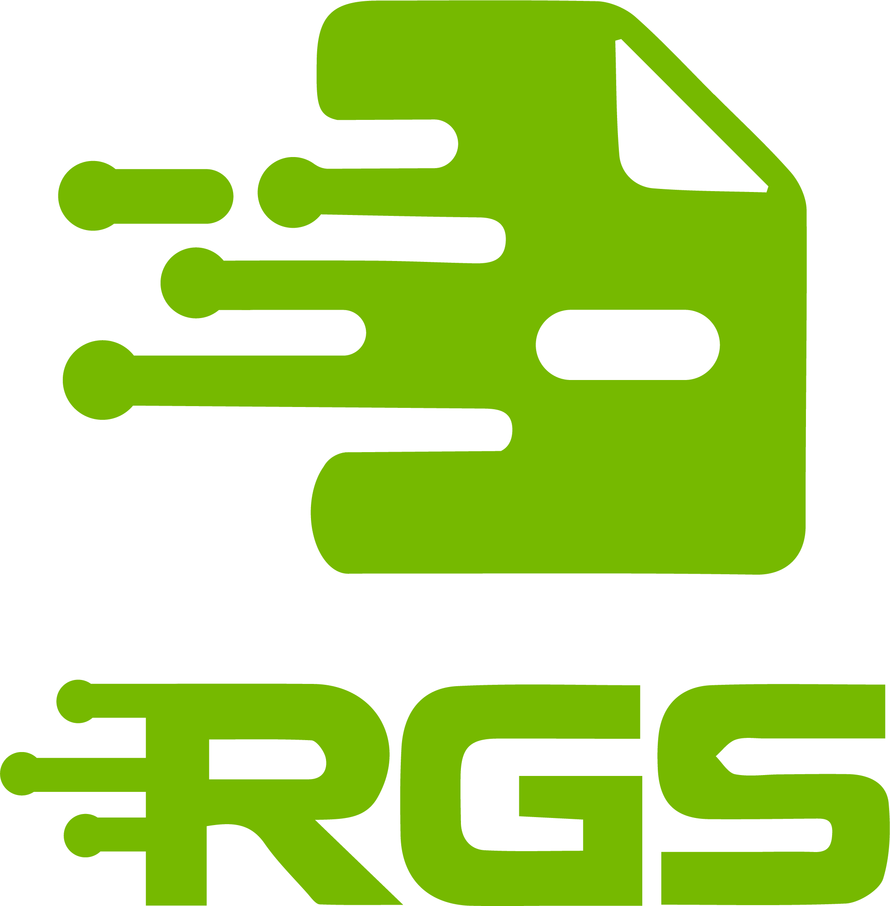
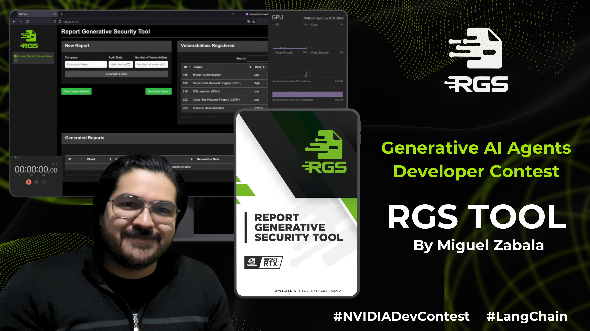
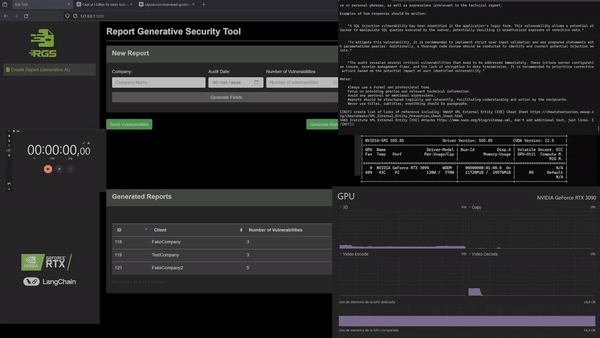
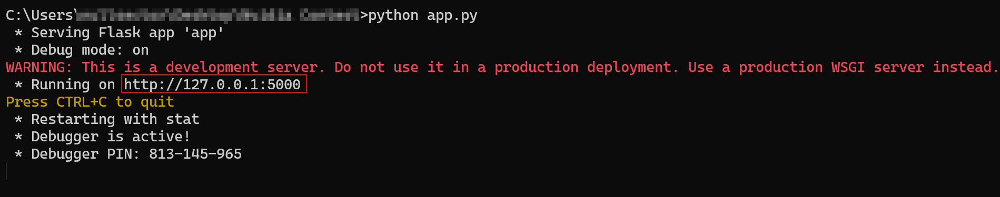
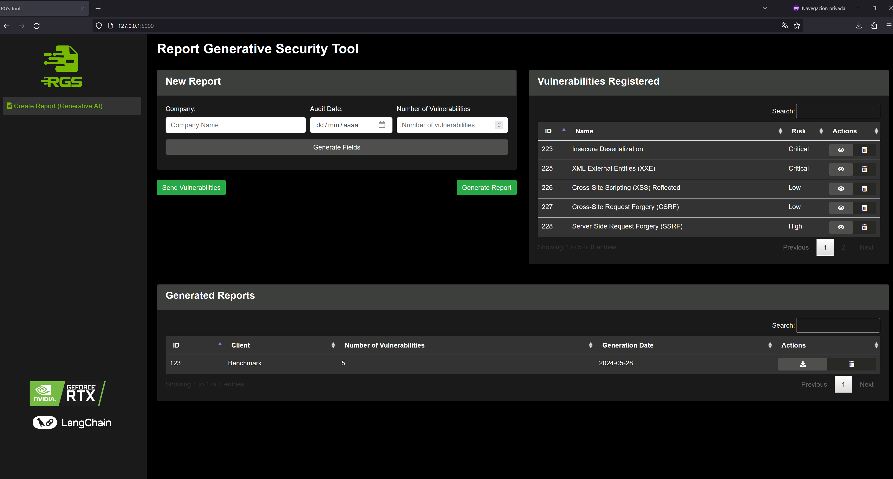

# Report Generative Security Tool (RGS)

<div align="center">
    
</div>


## ABOUT

The **Report Generative Security Tool (RGS)** is an innovative project developed with love by [Miguel Zabala](https://www.linkedin.com/in/miguelzabalap/) for the [Generative AI Agents Developer Contest organized by NVIDIA and LangChain](https://www.nvidia.com/en-us/ai-data-science/generative-ai/developer-contest-with-langchain/). This project leverages Large Language Models (LLMs) via OpenAI-compatible API to automate and optimize the generation of comprehensive security audit reports.

Contest video: [Youtube](https://youtu.be/ED45kjvfaSQ?si=5_bE4Pv1JhcnmYT6)

[](https://opensource.org/licenses/MIT)
[](https://www.python.org/downloads/release/python-380/)
[](https://flask.palletsprojects.com/en/1.1.x/)


<div align="center">
   <a href="https://www.youtube.com/watch?v=ED45kjvfaSQ">
      
   </a>
</div>


## TACKLING CYBERSECURITY CHALLENGES WITH CUTTING-EDGE SOLUTIONS

In the rapidly evolving field of cybersecurity, generating vulnerability reports is a critical yet time-consuming task. Consultants often spend hours documenting vulnerabilities, which reduces the time available for identifying and addressing new threats. This inefficiency hampers productivity and risks the quality and consistency of the reports.

Introducing the **Report Generative Security Tool (RGS)**, a groundbreaking application that revolutionizes vulnerability reporting by leveraging the power of Large Language Models (LLMs) to deliver highly accurate and detailed reports in record time.


### KEY BENEFITS:

- **Harnessing NVIDIA Technology**: Utilizes the power of NVIDIA's CUDA cores for unparalleled efficiency and speed.
- **AI-Powered Precision**: Ensures high-quality, consistent, and accurate reports.
- **Real-World Impact**: Frees consultants to focus on proactive threat detection and mitigation, enhancing overall security.

RGS is not just a technological advancement; it's a real-world solution that strengthens the cybersecurity landscape. By embracing NVIDIA's powerful hardware, we pave the way for more efficient and impactful security practices.

**Experience the future of cybersecurity with RGS—one report at a time.**

<div align="center">
    
</div>

## FEATURES

- **Generative AI Integration**: Leverages any OpenAI-compatible LLM (vLLM, Ollama, etc.) to generate comprehensive vulnerability reports.
- **Risk, Priority, and Complexity Analysis**: Visual charts to illustrate vulnerability distributions.
- **Automatic Report Generation**: Easily create professional-grade security audit reports.
- **Database Management**: Efficiently manage vulnerabilities and reports with SQLite.
- **User-Friendly Interface**: Intuitive web interface for managing and generating reports.


## CONFIDENTIALITY AND SECURITY

In the realm of cybersecurity, confidentiality is paramount. While solutions like ChatGPT are accessible to anyone, they pose significant risks regarding the confidentiality of sensitive information. This is a critical concern that makes such solutions unviable for many enterprises. 

The **Report Generative Security Tool (RGS)** addresses these concerns by ensuring that companies implementing this tool maintain full control over their data. With RGS, you can:

- **Ensure Confidentiality**: Keep sensitive information secure within your infrastructure.
- **Achieve Tracability**: Maintain detailed logs and traceability of generated reports and their sources.
- **Seamless Integration**: Deploy RGS in your production environments, fully integrated with your existing systems and workflows.

<div align="center">
    


</div>

## UNLEASH INTELLIGENT INSIGHTS WITH ADVANCED RAG ANALYSIS

**RGS Tool** integrates **Retrieval-Augmented Generation (RAG) analysis** with the power of LangChain and NVIDIA, transforming how you interact with your security reports. With RAG analysis, you'll gain:

- **Natural Language Insights**: Understand complex security data as if a seasoned consultant is explaining it to you, making it accessible and actionable for your team.
- **Dynamic Trend Tracking**: Effortlessly spot trends and monitor improvements or areas of concern, ensuring you stay ahead in your security posture.
- **Ever-Growing Intelligence**: The more reports you generate, the smarter and more insightful RGS becomes, continuously enhancing its understanding and providing deeper context.
- **Enhanced Decision-Making**: Make informed decisions based on comprehensive analysis and historical data trends, tailored to your specific security needs.

Harness the synergy of NVIDIA’s AI prowess and LangChain’s advanced language models to unlock deep, context-rich analysis with every use.

<div align="center">
    


</div>


## Blazing Fast with RTX Speed 🚀

The RGS tool demonstrates exceptional performance and efficiency in real-world scenarios. In our benchmarks, RGS generated 4749 words across 21 pages in less than a minute and a half, showcasing its ultra-fast processing capabilities. This speed and efficiency make RGS a powerful tool for consultants and security professionals who need to quickly generate comprehensive and accurate vulnerability reports.

<div align="center">
    


</div>

For a detailed benchmark, watch our [YouTube video](https://youtu.be/jU9_fqLk5P4) demonstrating the RGS tool power in action.


## USER-FRIENDLY INTERFACE

The **Report Generative Security Tool (RGS)** features a simple and easy-to-use graphical interface that allows users to:

- **Utilize Templates**: Access previously reported vulnerability templates for faster report generation.
- **Create New Entries**: Add new vulnerabilities with ease.
- **Modify Existing Entries**: Update and refine existing vulnerability details.
- **Delete Entries**: Remove outdated or irrelevant vulnerabilities.

This intuitive interface ensures that users can optimize their time by focusing on identifying critical vulnerabilities, thereby providing more value to clients and generating more precise and concise reports with the help of AI.

<div align="center">
    


</div>

## INSTALATION

To get started with RGS, follow these steps:

1. **Clone the repository**:
    ```bash
    git clone https://github.com/yourusername/RGS.git
    cd RGS
    ```

2. **Start virtual enviroment**:
    ```bash
    python -m venv env
    .\env\Scripts\activate
    ```
3. **Install dependencies**:
    ```bash
    pip install -r requirements.txt
    ```
    
4. **Configure your LLM**:
    Edit `.env` and set your LLM endpoint:
    ```bash
    LLM_BASE_URL=http://your-llm-server:port/v1
    LLM_MODEL=your-model-name
    ```


## USAGE

1. **Run the application**:
    ```bash
    python app.py
    ```
<div align="center">
    
</div>

2. **Access the application**:
    Open your web browser and navigate to `http://127.0.0.1:5000/`.

   <div align="center">
    
</div>

3. **Generate Reports**:
    - Enter the company name, audit date, and number of vulnerabilities.
    - Click on "Generate Fields" to input vulnerability details.
    - Submit vulnerabilities and generate the report.
  
## EXTENDED DEMO

Experience the full potential of the **Report Generative Security Tool (RGS)** through an extended demo. In this section, we showcase the capabilities of RGS with a pseudo real-world example. Watch how RGS generates comprehensive security audit reports efficiently and accurately.

<div align="center">
    
</div>

For a detailed walkthrough, watch our [YouTube video](https://www.youtube.com/watch?v=j4wibVN09cI) demonstrating the RGS tool deployment and his power in action.


## SECURITY

### Environment Configuration

Before running the application, configure environment variables:

1. Copy `.env.example` to `.env`:
    ```bash
    copy .env.example .env
    ```
2. Edit `.env` and set your own values:
    - `SECRET_KEY`: Generate a random key (e.g., `python -c "import secrets; print(secrets.token_hex(32))"`)
    - `ADMIN_USERNAME`: Your admin username
    - `ADMIN_PASSWORD`: Your admin password (will be hashed with bcrypt)
    - `LLM_BASE_URL`, `LLM_MODEL`, `LLM_API_KEY`: Your LLM endpoint configuration

### Security Features

This project implements the following security measures:

- **Authentication**: Flask-Login with bcrypt password hashing
- **Input Validation**: All inputs validated and sanitized before processing
- **XSS Protection**: Safe DOM manipulation (no innerHTML usage)
- **Path Traversal Protection**: File operations validated against allowed directories
- **Prompt Injection Protection**: AI prompts sanitized and structured with delimiters
- **Rate Limiting**: All endpoints protected against abuse
- **Security Headers**: CSP, X-Frame-Options, X-Content-Type-Options, and more
- **SRI Hashes**: All CDN resources verified with Subresource Integrity
- **Secure Sessions**: Cryptographically secure session management
- **Error Handling**: Centralized error handling with no information leakage
- **No Hardcoded Secrets**: All sensitive configuration via environment variables

### Docker Deployment

For production deployment, use Docker:

```bash
docker-compose up -b
```

The Docker image runs as a non-root user with read-only filesystem and minimal privileges.

### Reporting Vulnerabilities

See [SECURITY.md](SECURITY.md) for responsible disclosure guidelines.


## License

This project is open-source and licensed for the Generative AI Agents Developer Contest organized by NVIDIA and LangChain.

Developed by Miguel Zabala (Nullsector) for the [Generative AI Agents Developer Contest organized by NVIDIA and LangChain](https://www.nvidia.com/en-us/ai-data-science/generative-ai/developer-contest-with-langchain/). RGS leverages open-source software to make it easier to produce professional-grade security reports with minimal effort.


---

## Últimos Cambios

### 2026-06-16 — Hardening de seguridad y actualización de dependencias

Se realizó una auditoría de seguridad completa y se aplicaron las siguientes mejoras:

#### Seguridad
- **Autenticación**: Implementado Flask-Login con bcrypt para proteger todos los endpoints
- **Protección CSRF**: Decorador `@csrf_protect` aplicado a todos los endpoints POST, tokens CSRF integrados en el frontend
- **XSS**: Eliminado todo uso de `innerHTML`, reemplazado por `createElement`/`textContent`
- **Rate Limiting**: Todos los endpoints protegidos contra abuso
- **Path Traversal**: Validación de rutas con `os.path.realpath()`
- **Inyección de Prompts**: Sanitización de entradas antes de enviar al LLM
- **Headers de Seguridad**: CSP, X-Frame-Options, X-Content-Type-Options, Referrer-Policy
- **Audit Trail**: Tabla `audit_log` con registro de acciones (usuario, IP, timestamp)
- **Modo Debug**: Controlado por variable de entorno, desactivado por defecto

#### Dependencias
- **Limpiadas**: Eliminadas ~55 dependencias del stack ML (LangChain, FAISS, transformers, torch, etc.) que ya no se utilizan tras simplificar el RAG a keyword-based
- **Actualizadas**: Flask 3.1.3, Werkzeug 3.1.8, requests 2.34.2, bcrypt 5.0.0, Pillow 12.2.0, numpy 2.4.6, y todas las demás dependencias a sus últimas versiones
- **Dependabot**: Alertas reducidas de 96 a 0

#### Calidad del Reporte
- **Idioma**: Todos los prompts de generación de reportes traducidos a español para mantener consistencia con los datos de entrada
- **Secciones**: Traducidos los headings (INTRODUCCIÓN, RESUMEN EJECUTIVO, RESUMEN TÉCNICO, etc.) y headers de tablas (Riesgo, Prioridad, etc.)
- **Referencias**: Manejo adecuado cuando no se proporcionan referencias externas
- **LLM**: Integración con modelos razonadores vía API compatible OpenAI (vLLM/Ollama)

#### Infraestructura
- **Docker**: Imagen multi-stage con usuario no-root y filesystem de solo lectura
- **CI/CD**: GitHub Actions con Bandit (SAST), pip-audit, gitleaks y verificación de archivos sensibles
- **Dependabot**: Configurado para actualizaciones semanales de pip y GitHub Actions

#### Commits
```
3467cca fix: mejorar calidad del reporte - prompts en español y consistencia de idioma
bfdb1ff fix: corregir Security Scan workflow - gitleaks action y actualizar actions
dc02517 fix: actualizar fonttools a 4.63.0 para corregir CVE de path traversal
b14f25c chore: forzar re-escaneo de Dependabot tras actualizar dependencias
55d9f52 fix: actualizar dependencias y eliminar stack ML no utilizado
5de02b3 fix: aplicar protección CSRF a endpoints POST y frontend
83c3053 security: LLM integration, CSP fix, Playwright test suite (30/30 passing)
009fbc6 security: final fixes - audit trail, broken endpoint, CSRF tokens
2f361d1 security: infrastructure hardening - Phase 3
0a28ba6 security: comprehensive hardening - Phase 1 & 2
81d64fa security: implement authentication and authorization system
```

